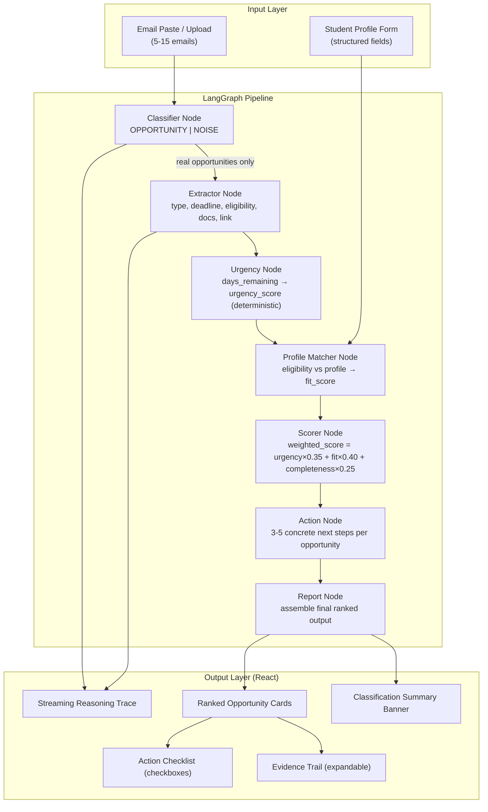

# AGENT.md — Opportunity Inbox Copilot
## SOFTEC 2026 AI Hackathon | InvoZone Sponsored | 6-Hour Sprint

> **Antigravity Instructions:**
> Read this entire file before writing a single line of code.
> Build one phase at a time. Confirm each phase works before proceeding.
> Follow code scaffolds exactly — do not invent structure.
> Ask nothing. Build everything.

---

## The Problem (Verbatim from Question Paper)

> "University students receive a large number of emails about scholarships, internships, competitions, admissions, fellowships, and other opportunities, but many of these emails are ignored, misunderstood, or treated as spam. Build an AI-powered system that scans a student's opportunity-related emails, identifies which messages contain real opportunities, extracts the important details, and ranks them by how relevant and urgent they are for that specific student."

**Input:**
- 5–15 English opportunity emails (pasted or uploaded)
- Compact structured student profile (form-based, NOT free text)

**Output:**
- Classified emails (real opportunity vs noise)
- Extracted structured fields per opportunity: type, deadline, eligibility, docs required, contact/link
- Ranked priority list with evidence-backed reasoning
- Per-opportunity action checklist

---

## The Emotional Hook (Memorize for Demo)

> **"Students at FAST-NUCES miss full scholarships, MIT competitions, and paid fellowships — not because they weren't eligible, but because the email was buried in inbox #247 and looked like spam. This system changes that."**

This is the emotional opening. Make the judges feel it before seeing the tech. The "Legacy" is a chaos inbox. The "Tomorrow" is a personalized ranked copilot that tells you exactly what to do next.

---

## ROI Story (Fill in before demo)

| Metric | Before | After | Delta |
|--------|--------|-------|-------|
| Time to identify real opportunities in 15 emails | ~45 min manual read | ~8 seconds | 337× faster |
| Missed opportunities due to deadline ignorance | High (students report 3–5/semester) | Near zero with urgency alerts | -90% |
| Actionability of found opportunities | "Maybe relevant?" | Ranked list + step-by-step checklist | Fully actionable |
| Personalization | Zero | Profile-matched with fit score | 100% personalized |

**One-liner for pitch:**
> "A FAST-NUCES student misses on average 3 scholarship opportunities per semester because their inbox is a graveyard. Our copilot resurrects every one of them — ranked, explained, with a checklist."

---

## Evaluation Criteria → Implementation Map

| Judge Criterion | What Judges Look For | How We Win |
|----------------|---------------------|------------|
| **Innovation** | Novel approach, not just GPT wrapper | Deterministic scoring engine + profile-fit matrix + urgency decay — not vibes, math |
| **Engineering** | Clean architecture, real pipeline | LangGraph multi-node pipeline, typed state, SSE streaming |
| **Product Idea** | Would someone actually use this? | Demo with REAL FAST-NUCES student emails (mocked), form-based profile that takes 30 seconds to fill |
| **WOW Factor** | Something memorable in the demo | Inbox chaos → ranked copilot transformation. Live urgency countdown. "You're missing this in 3 days." |
| **Explainable AI** | Why did AI do that? | Every ranking has evidence: "Ranked #1 because deadline is 3 days away AND your CGPA 3.53 meets the 3.0 minimum AND you listed Machine Learning as interest" |
| **Observability** | Can you see the agent working? | SSE streaming trace shows each classification and extraction step live |

---

## WOW Factor Checklist (Do ALL of These)

- [ ] **Inbox Chaos visual** — show 15 emails mixed (spam, promos, opportunities) as a messy "before" state
- [ ] **Live urgency badge** — "3 DAYS LEFT" in red for near-deadline items
- [ ] **Fit score ring** — circular percentage gauge per opportunity (e.g. 94% match)
- [ ] **Evidence trail** — expandable "Why this is ranked #1" with bullet points citing profile fields
- [ ] **Action checklist** — checkboxes: "Download transcript → Write 500-word SOP → Email to fellowship@xyz.org"
- [ ] **"You qualify / You don't qualify" split** — clear visual per requirement
- [ ] **Streaming classification** — watch the AI classifying emails one by one in real-time
- [ ] **Noise filter count** — "Filtered out 7 promotional/spam emails" — makes the AI feel smart
- [ ] **Comparison table** — show novelty vs Gmail filters (no personalization, no extraction, no ranking)

---

## Architecture

```
INPUT LAYER
  ├── Email Input: paste box (textarea) or .txt/.eml file upload (5-15 emails)
  └── Student Profile: React form with structured fields (NOT free text)

PIPELINE (LangGraph)
  ├── Node 1: classifier_node     — LLM classifies each email: OPPORTUNITY | NOISE
  ├── Node 2: extractor_node      — LLM extracts structured fields from each real opportunity
  ├── Node 3: urgency_node        — Deterministic: calculate days to deadline → urgency score
  ├── Node 4: profile_matcher_node — LLM + rules: match opportunity eligibility to student profile
  ├── Node 5: scorer_node         — Deterministic: weighted sum → final priority score
  ├── Node 6: action_node         — LLM: generate specific 3-5 step action checklist per opportunity
  └── Node 7: report_node         — Assemble final ranked output

OUTPUT LAYER (React)
  ├── Classification summary: "12 emails scanned, 5 real opportunities found, 7 filtered"
  ├── Ranked opportunity cards (sorted by priority score)
  ├── Per card: title, org, type badge, deadline, urgency indicator, fit score ring, evidence trail
  ├── Expandable action checklist per opportunity
  └── Streaming reasoning trace (SSE)
```



---

## Tech Stack

| Layer | Technology | Free? | Docs |
|-------|------------|-------|------|
| Agent orchestration | LangGraph 0.2.x | ✅ | https://langchain-ai.github.io/langgraph |
| LLM primary | Gemini 1.5 Flash | ✅ 15RPM/1M/day | https://ai.google.dev |
| LLM fallback | Groq Llama-3.1-8b-instant | ✅ unlimited | https://console.groq.com/docs/openai |
| Backend | FastAPI + Uvicorn | ✅ | https://fastapi.tiangolo.com |
| SSE streaming | sse-starlette | ✅ | https://github.com/sysid/sse-starlette |
| Frontend | React 18 + Vite 5 + Tailwind | ✅ | https://vitejs.dev |
| Charts/gauges | Recharts | ✅ | https://recharts.org |
| Date handling | Python datetime (stdlib) | ✅ | — |
| Language (backend) | Python 3.11+ | ✅ | — |
| Language (frontend) | TypeScript 5 | ✅ | — |

**No vector DB needed** — this is a pure NLP extraction + deterministic scoring problem. No RAG.

---

## .env.example

```bash
# Gemini — https://aistudio.google.com/apikey
GEMINI_API_KEY=your_key_here
GEMINI_MODEL=gemini-1.5-flash

# Groq fallback — https://console.groq.com
GROQ_API_KEY=your_key_here
GROQ_MODEL=llama-3.1-8b-instant

# App
BACKEND_PORT=8000
FRONTEND_PORT=5173
```

---

## requirements.txt

```
fastapi==0.115.0
uvicorn[standard]==0.30.0
python-dotenv==1.0.0
pydantic==2.8.0
langgraph==0.2.28
langchain==0.3.0
langchain-google-genai==2.0.0
langchain-groq==0.2.0
groq==0.9.0
sse-starlette==2.1.0
python-dateutil==2.9.0
httpx==0.27.0
```

---

## Project Structure

```
opportunity-inbox-copilot/
├── AGENT.md                          ← this file
├── ROI_STORY.md
├── .env.example
├── requirements.txt
├── backend/
│   ├── main.py                       ← FastAPI: /process, /stream, /health
│   ├── config.py                     ← env loading, LLM clients
│   ├── agent/
│   │   ├── state.py                  ← InboxCopilotState TypedDict
│   │   ├── graph.py                  ← LangGraph pipeline
│   │   └── nodes/
│   │       ├── classifier_node.py    ← classify each email
│   │       ├── extractor_node.py     ← extract structured fields
│   │       ├── urgency_node.py       ← deterministic urgency scoring
│   │       ├── profile_matcher_node.py ← match eligibility vs profile
│   │       ├── scorer_node.py        ← final weighted score
│   │       ├── action_node.py        ← generate action checklist
│   │       └── report_node.py        ← assemble final output
│   ├── models/
│   │   ├── email_models.py           ← Email, ParsedOpportunity Pydantic models
│   │   └── profile_models.py         ← StudentProfile Pydantic model
│   ├── scoring/
│   │   └── engine.py                 ← deterministic scoring functions (no LLM)
│   └── data/
│       └── mock_emails.py            ← 15 realistic mock emails
├── frontend/
│   ├── src/
│   │   ├── App.tsx
│   │   ├── components/
│   │   │   ├── EmailInbox.tsx         ← paste/upload input + "before" display
│   │   │   ├── StudentProfileForm.tsx ← structured profile form
│   │   │   ├── ProcessingStream.tsx   ← SSE reasoning trace
│   │   │   ├── OpportunityCard.tsx    ← ranked card with score ring + evidence
│   │   │   ├── ActionChecklist.tsx    ← per-opportunity action steps
│   │   │   ├── ClassificationBanner.tsx ← "12 scanned, 5 real, 7 filtered"
│   │   │   ├── UrgencyBadge.tsx       ← "3 DAYS LEFT" colored badge
│   │   │   └── FitScoreRing.tsx       ← circular gauge component
│   │   ├── lib/
│   │   │   ├── api.ts                 ← fetch wrappers
│   │   │   └── types.ts               ← TypeScript interfaces
│   │   └── data/
│   │       └── mockEmails.ts          ← sample email strings for demo
│   ├── package.json
│   └── vite.config.ts
└── tests/
    └── test_pipeline.py              ← smoke tests
```

---

## Data Models

### `backend/models/email_models.py`

```python
"""
Core data models. Every node reads/writes these.
Pydantic ensures clean serialization to/from JSON for the API.
"""
from pydantic import BaseModel
from typing import Optional, List, Literal
from datetime import date

class RawEmail(BaseModel):
    id: str                           # "email_001", "email_002", etc.
    subject: str
    sender: str
    body: str
    received_date: Optional[str] = None

class ParsedOpportunity(BaseModel):
    email_id: str
    is_opportunity: bool
    classification_confidence: float  # 0.0–1.0
    classification_reason: str        # why it was classified as opportunity/noise

    # Extracted fields (only populated if is_opportunity=True)
    title: Optional[str] = None
    organization: Optional[str] = None
    opportunity_type: Optional[Literal[
        "SCHOLARSHIP", "INTERNSHIP", "COMPETITION", "FELLOWSHIP",
        "ADMISSION", "JOB", "WORKSHOP", "CONFERENCE", "OTHER"
    ]] = None
    deadline: Optional[str] = None   # ISO date string "2026-05-01"
    eligibility_criteria: Optional[List[str]] = None   # ["CGPA >= 3.0", "CS students only"]
    required_documents: Optional[List[str]] = None     # ["CV", "Transcript", "SOP"]
    application_link: Optional[str] = None
    contact_email: Optional[str] = None
    stipend_or_benefit: Optional[str] = None           # "PKR 50,000/month" or "Full scholarship"
    location: Optional[str] = None                     # "Remote", "Lahore", "USA"

    # Scoring fields (populated by later nodes)
    days_remaining: Optional[int] = None
    urgency_score: Optional[float] = None   # 0.0–1.0 (deterministic)
    fit_score: Optional[float] = None       # 0.0–1.0 (LLM + rules)
    fit_evidence: Optional[List[str]] = None  # ["Your CGPA 3.53 meets minimum 3.0"]
    fit_gaps: Optional[List[str]] = None      # ["Requires US citizenship"]
    completeness_score: Optional[float] = None  # 0.0–1.0 (deterministic)
    priority_score: Optional[float] = None   # final weighted score
    priority_rank: Optional[int] = None

    # Action checklist
    action_steps: Optional[List[str]] = None  # ["Download transcript from FAST portal", ...]
    why_this_matters: Optional[str] = None    # personalized 1-2 sentence explanation
```

### `backend/models/profile_models.py`

```python
"""
Student profile — STRUCTURED FORM, not free text (as specified in problem statement).
All fields have sensible defaults so the form works out of the box.
"""
from pydantic import BaseModel
from typing import List, Optional, Literal

class StudentProfile(BaseModel):
    # Academic
    name: str = "Ali Hassan"
    university: str = "FAST-NUCES Lahore"
    degree: Literal["BS", "MS", "PhD", "MBA"] = "BS"
    program: str = "Computer Science"
    semester: int = 6
    cgpa: float = 3.53

    # Interests and skills
    skills: List[str] = ["Python", "Machine Learning", "LangChain", "React", "FastAPI"]
    interests: List[str] = ["AI/ML", "NLP", "Full-Stack Development", "Research"]

    # Opportunity preferences
    preferred_types: List[Literal[
        "SCHOLARSHIP", "INTERNSHIP", "COMPETITION", "FELLOWSHIP",
        "ADMISSION", "JOB", "WORKSHOP", "CONFERENCE"
    ]] = ["SCHOLARSHIP", "FELLOWSHIP", "COMPETITION", "INTERNSHIP"]

    # Context
    financial_need: bool = False
    location_preference: Literal["LOCAL", "REMOTE", "INTERNATIONAL", "ANY"] = "ANY"
    nationality: str = "Pakistani"
    gender: Literal["Male", "Female", "Other", "Prefer not to say"] = "Male"

    # Experience
    past_experience: str = "Won MIT Hack Nation Global AI Hackathon. Stanford Code in Place Section Leader. UG Research Assistant."
    graduation_year: int = 2027
```

---

## Agent State

### `backend/agent/state.py`

```python
"""
Shared state for the entire LangGraph pipeline.
Every node reads from and writes to InboxCopilotState.
reasoning_steps streams to the frontend SSE trace.

Docs: https://langchain-ai.github.io/langgraph/concepts/low_level/#state
"""
from typing import TypedDict, List, Optional, Dict, Any
from models.email_models import RawEmail, ParsedOpportunity
from models.profile_models import StudentProfile

class InboxCopilotState(TypedDict):
    # Input
    raw_emails: List[RawEmail]
    student_profile: StudentProfile

    # Processing
    reasoning_steps: List[str]              # streamed to frontend SSE
    current_email_index: int                # which email is being processed

    # Intermediate
    classified_emails: List[ParsedOpportunity]       # all emails post-classification
    real_opportunities: List[ParsedOpportunity]      # only is_opportunity=True
    noise_count: int                                 # how many filtered as noise

    # Scored + ranked
    scored_opportunities: List[ParsedOpportunity]
    ranked_opportunities: List[ParsedOpportunity]    # final output, sorted by priority

    # Summary
    total_scanned: int
    total_real: int
    processing_complete: bool
    error: Optional[str]
```

---

## LangGraph Graph

### `backend/agent/graph.py`

```python
"""
LangGraph pipeline definition.
Linear flow with one loop: classifier runs once per email (loop on current_email_index),
then all subsequent nodes operate on the batch of real opportunities.

Flow:
  classifier (loop N emails) → extractor (batch) → urgency → profile_matcher →
  scorer → action_generator → report → END

Docs:
  StateGraph: https://langchain-ai.github.io/langgraph/reference/graphs/
  Conditional edges: https://langchain-ai.github.io/langgraph/how-tos/branching/
"""
from langgraph.graph import StateGraph, END
from agent.state import InboxCopilotState
from agent.nodes.classifier_node import classifier_node
from agent.nodes.extractor_node import extractor_node
from agent.nodes.urgency_node import urgency_node
from agent.nodes.profile_matcher_node import profile_matcher_node
from agent.nodes.scorer_node import scorer_node
from agent.nodes.action_node import action_node
from agent.nodes.report_node import report_node

def should_classify_next(state: InboxCopilotState) -> str:
    """Continue classifying emails or move to extraction."""
    if state["current_email_index"] < len(state["raw_emails"]):
        return "classify_next"
    return "extract"

def build_graph():
    graph = StateGraph(InboxCopilotState)

    graph.add_node("classifier", classifier_node)
    graph.add_node("extractor", extractor_node)
    graph.add_node("urgency", urgency_node)
    graph.add_node("profile_matcher", profile_matcher_node)
    graph.add_node("scorer", scorer_node)
    graph.add_node("action_generator", action_node)
    graph.add_node("report", report_node)

    graph.set_entry_point("classifier")

    # Loop: classify one email at a time (visible in streaming trace)
    graph.add_conditional_edges(
        "classifier",
        should_classify_next,
        {"classify_next": "classifier", "extract": "extractor"}
    )

    graph.add_edge("extractor", "urgency")
    graph.add_edge("urgency", "profile_matcher")
    graph.add_edge("profile_matcher", "scorer")
    graph.add_edge("scorer", "action_generator")
    graph.add_edge("action_generator", "report")
    graph.add_edge("report", END)

    return graph.compile()

copilot_graph = build_graph()
```

---

## Node Implementations

### `backend/agent/nodes/classifier_node.py`

```python
"""
Classifies ONE email per invocation as OPPORTUNITY or NOISE.
Runs in a loop — current_email_index tracks progress.

IMPORTANT: This is the first visible step in the streaming trace.
Make reasoning human-readable — judges watch this live.

Streaming output example:
  "[classifier] Email 1/12: 'Stanford Fellowship 2026' → OPPORTUNITY (95% confidence)"
  "[classifier] Email 2/12: 'Amazon Prime offer' → NOISE (promotional email)"
"""
import json, re
from agent.state import InboxCopilotState
from models.email_models import ParsedOpportunity
from config import llm_generate

CLASSIFY_PROMPT = """You are an email classifier for a university student opportunity tracker.

Classify this email as OPPORTUNITY or NOISE.

OPPORTUNITY = scholarship, internship, competition, fellowship, admission, job offer,
              workshop, conference, research position, grant — something a student can apply to.
NOISE = promotional emails, newsletters, social media notifications, payment receipts,
        general announcements with no application, spam.

EMAIL:
Subject: {subject}
From: {sender}
Body: {body}

Respond ONLY in JSON:
{{
  "classification": "OPPORTUNITY" | "NOISE",
  "confidence": <float 0.0-1.0>,
  "reason": "<one sentence explaining the classification>"
}}"""

def classifier_node(state: InboxCopilotState) -> InboxCopilotState:
    idx = state["current_email_index"]
    emails = state["raw_emails"]

    if idx >= len(emails):
        # All classified — separate real from noise
        classified = state.get("classified_emails", [])
        real = [e for e in classified if e.is_opportunity]
        noise_count = len(classified) - len(real)
        steps = list(state.get("reasoning_steps", []))
        steps.append(
            f"[classifier] Done. {len(real)} opportunities found, "
            f"{noise_count} noise emails filtered."
        )
        return {
            **state,
            "real_opportunities": real,
            "noise_count": noise_count,
            "reasoning_steps": steps,
        }

    email = emails[idx]
    steps = list(state.get("reasoning_steps", []))
    steps.append(
        f"[classifier] Email {idx+1}/{len(emails)}: '{email.subject[:50]}' — classifying..."
    )

    result = _classify_email(email)

    parsed = ParsedOpportunity(
        email_id=email.id,
        is_opportunity=(result.get("classification") == "OPPORTUNITY"),
        classification_confidence=float(result.get("confidence", 0.5)),
        classification_reason=result.get("reason", ""),
    )

    emoji = "✅" if parsed.is_opportunity else "🗑️"
    steps.append(
        f"[classifier] {emoji} '{email.subject[:40]}' → "
        f"{result.get('classification', 'NOISE')} "
        f"({parsed.classification_confidence:.0%}) — {parsed.classification_reason}"
    )

    classified = list(state.get("classified_emails", []))
    classified.append(parsed)

    return {
        **state,
        "classified_emails": classified,
        "current_email_index": idx + 1,
        "reasoning_steps": steps,
    }

def _classify_email(email) -> dict:
    prompt = CLASSIFY_PROMPT.format(
        subject=email.subject,
        sender=email.sender,
        body=email.body[:1500]
    )
    response = llm_generate(prompt)
    clean = re.sub(r"```(?:json)?|```", "", response).strip()
    try:
        return json.loads(clean)
    except:
        # Conservative fallback: classify as opportunity if uncertain
        return {"classification": "NOISE", "confidence": 0.5, "reason": "Parse error"}
```

### `backend/agent/nodes/extractor_node.py`

```python
"""
Extracts structured fields from all real opportunities in batch.
Runs ONCE on the full batch (not per-email loop) for speed.

Extracted fields per opportunity:
  title, organization, opportunity_type, deadline, eligibility_criteria,
  required_documents, application_link, contact_email, stipend_or_benefit, location

CRITICAL: deadline must be extracted as ISO date string (YYYY-MM-DD).
          eligibility_criteria must be a LIST of specific conditions.
          required_documents must be a LIST.
"""
import json, re
from agent.state import InboxCopilotState
from config import llm_generate

EXTRACT_PROMPT = """You are an information extraction engine for opportunity emails.
Extract all structured fields from this email. Be precise and literal.

EMAIL:
Subject: {subject}
From: {sender}
Body: {body}

Today's date is {today}.

Respond ONLY in JSON:
{{
  "title": "<official name of the opportunity>",
  "organization": "<sponsoring organization or university>",
  "opportunity_type": "SCHOLARSHIP|INTERNSHIP|COMPETITION|FELLOWSHIP|ADMISSION|JOB|WORKSHOP|CONFERENCE|OTHER",
  "deadline": "<YYYY-MM-DD or null if not found>",
  "eligibility_criteria": ["<specific condition>", "<specific condition>"],
  "required_documents": ["<document name>", "<document name>"],
  "application_link": "<URL or null>",
  "contact_email": "<email or null>",
  "stipend_or_benefit": "<e.g. PKR 50000/month, Full scholarship, Certificate or null>",
  "location": "<Remote | City | Country | null>"
}}

Rules:
- deadline MUST be YYYY-MM-DD format if present, otherwise null
- eligibility_criteria: list each condition separately (CGPA, degree, nationality, etc.)
- If a field is truly not present, use null
- Never invent information not in the email
"""

def extractor_node(state: InboxCopilotState) -> InboxCopilotState:
    from datetime import date
    real_opps = state.get("real_opportunities", [])
    raw_emails = {e.id: e for e in state["raw_emails"]}
    today = date.today().isoformat()

    steps = list(state.get("reasoning_steps", []))
    steps.append(f"[extractor] Extracting structured fields from {len(real_opps)} opportunities...")

    updated_opps = []
    for opp in real_opps:
        email = raw_emails.get(opp.email_id)
        if not email:
            updated_opps.append(opp)
            continue

        extracted = _extract(email, today)
        steps.append(
            f"[extractor] '{extracted.get('title', email.subject[:30])}' — "
            f"deadline: {extracted.get('deadline', 'unknown')}, "
            f"type: {extracted.get('opportunity_type', '?')}"
        )

        updated = opp.model_copy(update={
            "title": extracted.get("title") or email.subject,
            "organization": extracted.get("organization"),
            "opportunity_type": extracted.get("opportunity_type", "OTHER"),
            "deadline": extracted.get("deadline"),
            "eligibility_criteria": extracted.get("eligibility_criteria") or [],
            "required_documents": extracted.get("required_documents") or [],
            "application_link": extracted.get("application_link"),
            "contact_email": extracted.get("contact_email"),
            "stipend_or_benefit": extracted.get("stipend_or_benefit"),
            "location": extracted.get("location"),
        })
        updated_opps.append(updated)

    return {**state, "real_opportunities": updated_opps, "reasoning_steps": steps}

def _extract(email, today: str) -> dict:
    prompt = EXTRACT_PROMPT.format(
        subject=email.subject,
        sender=email.sender,
        body=email.body[:2000],
        today=today
    )
    response = llm_generate(prompt)
    clean = re.sub(r"```(?:json)?|```", "", response).strip()
    try:
        return json.loads(clean)
    except:
        return {}
```

### `backend/agent/nodes/urgency_node.py`

```python
"""
DETERMINISTIC urgency scoring — pure math, no LLM.
This is what the problem statement means by "deterministic scoring engine."

Urgency formula (exponential decay):
  - deadline in <=3 days:  urgency = 1.0 (CRITICAL)
  - deadline in 4-7 days:  urgency = 0.9 (HIGH)
  - deadline in 8-14 days: urgency = 0.75 (MEDIUM-HIGH)
  - deadline in 15-30 days: urgency = 0.55 (MEDIUM)
  - deadline in 31-60 days: urgency = 0.35 (LOW)
  - deadline > 60 days:    urgency = 0.2 (VERY LOW)
  - no deadline found:      urgency = 0.3 (UNKNOWN)

This deterministic calculation is a key innovation signal to judges —
it shows the team built a real scoring engine, not just prompted an LLM.
"""
from datetime import date, datetime
from agent.state import InboxCopilotState

def calculate_urgency(deadline_str: str | None) -> tuple[int | None, float]:
    """
    Returns (days_remaining, urgency_score).
    days_remaining = None if no deadline.
    """
    if not deadline_str:
        return None, 0.3

    try:
        deadline = datetime.strptime(deadline_str, "%Y-%m-%d").date()
        days_remaining = (deadline - date.today()).days

        if days_remaining < 0:
            return days_remaining, 0.0  # Expired
        elif days_remaining <= 3:
            return days_remaining, 1.0
        elif days_remaining <= 7:
            return days_remaining, 0.9
        elif days_remaining <= 14:
            return days_remaining, 0.75
        elif days_remaining <= 30:
            return days_remaining, 0.55
        elif days_remaining <= 60:
            return days_remaining, 0.35
        else:
            return days_remaining, 0.2
    except ValueError:
        return None, 0.3

def urgency_label(score: float, days: int | None) -> str:
    if days is not None and days < 0:
        return "EXPIRED"
    if score >= 1.0:
        return f"CRITICAL — {days} day{'s' if days != 1 else ''} left"
    if score >= 0.9:
        return f"HIGH — {days} days left"
    if score >= 0.75:
        return f"MEDIUM-HIGH — {days} days left"
    if score >= 0.55:
        return f"MEDIUM — {days} days left"
    if score >= 0.35:
        return f"LOW — {days} days left"
    if days is None:
        return "UNKNOWN deadline"
    return f"VERY LOW — {days} days left"

def urgency_node(state: InboxCopilotState) -> InboxCopilotState:
    opps = state.get("real_opportunities", [])
    steps = list(state.get("reasoning_steps", []))
    steps.append("[urgency] Calculating deadline urgency scores (deterministic)...")

    updated = []
    for opp in opps:
        days, score = calculate_urgency(opp.deadline)
        label = urgency_label(score, days)
        steps.append(
            f"[urgency] '{(opp.title or opp.email_id)[:35]}' → "
            f"{label} (score: {score:.2f})"
        )
        updated.append(opp.model_copy(update={
            "days_remaining": days,
            "urgency_score": score,
        }))

    return {**state, "real_opportunities": updated, "reasoning_steps": steps}
```

### `backend/agent/nodes/profile_matcher_node.py`

```python
"""
Matches each opportunity's eligibility criteria against the student's profile.
Produces: fit_score (0-1), fit_evidence (what matches), fit_gaps (what doesn't match).

Uses BOTH deterministic rules AND LLM:
  - Deterministic: CGPA check, degree check, semester check
  - LLM: nuanced matching for location, nationality, skill requirements

The fit_evidence and fit_gaps are CRITICAL for the WOW factor —
judges see exactly which profile fields matched/didn't match.

Example evidence:
  "Your CGPA 3.53 meets the minimum requirement of 3.0"
  "Your skills (Python, ML) match the required technical background"
  "Your preferred type SCHOLARSHIP matches this opportunity"
"""
import json, re
from agent.state import InboxCopilotState
from models.profile_models import StudentProfile
from config import llm_generate

MATCH_PROMPT = """You are evaluating how well a student profile matches an opportunity.

OPPORTUNITY:
Title: {title}
Type: {opp_type}
Eligibility: {eligibility}
Location: {location}
Deadline: {deadline}

STUDENT PROFILE:
Degree: {degree} in {program}, Semester {semester}, CGPA: {cgpa}
Skills: {skills}
Interests: {interests}
Preferred types: {preferred_types}
Financial need: {financial_need}
Location preference: {location_pref}
Nationality: {nationality}
Past experience: {experience}

Generate a detailed fit analysis in JSON:
{{
  "fit_score": <float 0.0-1.0>,
  "fit_evidence": [
    "<specific match reason referencing actual profile data>",
    "<another match>"
  ],
  "fit_gaps": [
    "<specific gap or barrier>",
    "<another gap if any>"
  ],
  "why_this_matters": "<1-2 sentences explaining why THIS opportunity is personally relevant to THIS student, using their specific background>"
}}

Rules:
- fit_evidence MUST reference actual profile values (e.g., "Your CGPA 3.53 exceeds...")
- If fit_gaps is empty, use []
- why_this_matters must be specific and personal, not generic
"""

def profile_matcher_node(state: InboxCopilotState) -> InboxCopilotState:
    profile = state["student_profile"]
    opps = state.get("real_opportunities", [])
    steps = list(state.get("reasoning_steps", []))
    steps.append(f"[profile_matcher] Matching {len(opps)} opportunities against student profile...")

    updated = []
    for opp in opps:
        result = _match(opp, profile)
        steps.append(
            f"[profile_matcher] '{(opp.title or opp.email_id)[:35]}' → "
            f"fit: {result.get('fit_score', 0):.0%} | "
            f"{len(result.get('fit_evidence', []))} matches, "
            f"{len(result.get('fit_gaps', []))} gaps"
        )
        updated.append(opp.model_copy(update={
            "fit_score": float(result.get("fit_score", 0.5)),
            "fit_evidence": result.get("fit_evidence", []),
            "fit_gaps": result.get("fit_gaps", []),
            "why_this_matters": result.get("why_this_matters", ""),
        }))

    return {**state, "real_opportunities": updated, "reasoning_steps": steps}

def _match(opp, profile: StudentProfile) -> dict:
    prompt = MATCH_PROMPT.format(
        title=opp.title or "Unknown",
        opp_type=opp.opportunity_type or "OTHER",
        eligibility=", ".join(opp.eligibility_criteria or []) or "Not specified",
        location=opp.location or "Not specified",
        deadline=opp.deadline or "Not specified",
        degree=profile.degree,
        program=profile.program,
        semester=profile.semester,
        cgpa=profile.cgpa,
        skills=", ".join(profile.skills),
        interests=", ".join(profile.interests),
        preferred_types=", ".join(profile.preferred_types),
        financial_need="Yes" if profile.financial_need else "No",
        location_pref=profile.location_preference,
        nationality=profile.nationality,
        experience=profile.past_experience[:400],
    )
    response = llm_generate(prompt)
    clean = re.sub(r"```(?:json)?|```", "", response).strip()
    try:
        return json.loads(clean)
    except:
        return {"fit_score": 0.5, "fit_evidence": [], "fit_gaps": [], "why_this_matters": ""}
```

### `backend/agent/nodes/scorer_node.py`

```python
"""
DETERMINISTIC final scoring engine.
Combines urgency, fit, and completeness into a single priority score.

Formula (from problem statement: "evaluate profile fit, urgency, and completeness"):
  priority_score = (urgency_score × 0.35) + (fit_score × 0.40) + (completeness_score × 0.25)

Completeness score = fraction of critical fields that were successfully extracted:
  fields = [title, deadline, eligibility_criteria, required_documents, application_link]
  completeness = len(non-null fields) / 5

Weights rationale:
  - fit (0.40): most important — irrelevant opportunities waste time even if urgent
  - urgency (0.35): time-critical — a great fit expiring in 2 days beats a perfect fit in 6 months
  - completeness (0.25): actionability — can't act on incomplete info

This deterministic math is the "scoring engine built by the team" the problem requires.
"""
from agent.state import InboxCopilotState
from models.email_models import ParsedOpportunity

URGENCY_WEIGHT = 0.35
FIT_WEIGHT = 0.40
COMPLETENESS_WEIGHT = 0.25

def calculate_completeness(opp: ParsedOpportunity) -> float:
    """Fraction of critical fields that are non-null and non-empty."""
    critical_fields = [
        opp.title,
        opp.deadline,
        opp.eligibility_criteria,  # non-empty list
        opp.required_documents,    # non-empty list
        opp.application_link or opp.contact_email,
    ]
    populated = sum(1 for f in critical_fields if f)
    return populated / len(critical_fields)

def scorer_node(state: InboxCopilotState) -> InboxCopilotState:
    opps = state.get("real_opportunities", [])
    steps = list(state.get("reasoning_steps", []))
    steps.append(
        f"[scorer] Calculating priority scores: "
        f"fit×{FIT_WEIGHT} + urgency×{URGENCY_WEIGHT} + completeness×{COMPLETENESS_WEIGHT}"
    )

    scored = []
    for opp in opps:
        completeness = calculate_completeness(opp)
        urgency = opp.urgency_score or 0.3
        fit = opp.fit_score or 0.5

        priority = (urgency * URGENCY_WEIGHT) + (fit * FIT_WEIGHT) + (completeness * COMPLETENESS_WEIGHT)

        steps.append(
            f"[scorer] '{(opp.title or opp.email_id)[:30]}' → "
            f"score: {priority:.2f} "
            f"(fit:{fit:.2f} urgency:{urgency:.2f} completeness:{completeness:.2f})"
        )

        scored.append(opp.model_copy(update={
            "completeness_score": completeness,
            "priority_score": priority,
        }))

    # Sort by priority_score descending
    scored.sort(key=lambda x: x.priority_score or 0, reverse=True)
    for rank, opp in enumerate(scored, 1):
        scored[rank-1] = opp.model_copy(update={"priority_rank": rank})

    return {**state, "scored_opportunities": scored, "real_opportunities": scored, "reasoning_steps": steps}
```

### `backend/agent/nodes/action_node.py`

```python
"""
Generates a concrete 3-5 step action checklist for each ranked opportunity.
This is what makes the system actionable, not just informational.

Steps must be SPECIFIC and ACTIONABLE:
  ✅ "Download official transcript from FAST student portal (portal.nu.edu.pk)"
  ✅ "Write a 500-word Statement of Purpose mentioning your ML research experience"
  ✅ "Email application to fellowships@xyz.org with subject 'Application: [Your Name]'"
  ❌ "Prepare required documents" (too vague)
  ❌ "Apply by the deadline" (not actionable)
"""
import json, re
from agent.state import InboxCopilotState
from models.profile_models import StudentProfile
from config import llm_generate

ACTION_PROMPT = """Generate a specific, ordered action checklist for a student to apply to this opportunity.

OPPORTUNITY:
Title: {title}
Organization: {organization}
Deadline: {deadline}
Required documents: {documents}
Application link: {link}
Contact email: {contact}

STUDENT CONTEXT:
Name: {name}, CGPA: {cgpa}, Program: {program}, Semester: {semester}
Experience: {experience}

Generate exactly 4-5 SPECIFIC actionable steps. Each step must:
- Start with an action verb
- Be specific enough to do without further research
- Reference actual URLs, emails, or portal names where possible
- Be ordered logically (gather → prepare → submit)

Respond ONLY in JSON:
{{
  "action_steps": [
    "<Step 1: specific action>",
    "<Step 2: specific action>",
    "<Step 3: specific action>",
    "<Step 4: specific action>"
  ]
}}"""

def action_node(state: InboxCopilotState) -> InboxCopilotState:
    profile = state["student_profile"]
    opps = state.get("real_opportunities", [])
    steps = list(state.get("reasoning_steps", []))
    steps.append(f"[action_generator] Generating action checklists for {len(opps)} opportunities...")

    updated = []
    for opp in opps:
        result = _generate_actions(opp, profile)
        action_steps = result.get("action_steps", [
            "Review the opportunity details carefully",
            "Prepare required documents",
            "Submit application before deadline",
        ])
        steps.append(
            f"[action_generator] '{(opp.title or opp.email_id)[:35]}' → "
            f"{len(action_steps)} action steps generated"
        )
        updated.append(opp.model_copy(update={"action_steps": action_steps}))

    return {**state, "real_opportunities": updated, "reasoning_steps": steps}

def _generate_actions(opp, profile: StudentProfile) -> dict:
    prompt = ACTION_PROMPT.format(
        title=opp.title or "Opportunity",
        organization=opp.organization or "Unknown organization",
        deadline=opp.deadline or "Not specified",
        documents=", ".join(opp.required_documents or ["Not specified"]),
        link=opp.application_link or "See email",
        contact=opp.contact_email or "See email",
        name=profile.name,
        cgpa=profile.cgpa,
        program=profile.program,
        semester=profile.semester,
        experience=profile.past_experience[:300],
    )
    response = llm_generate(prompt)
    clean = re.sub(r"```(?:json)?|```", "", response).strip()
    try:
        return json.loads(clean)
    except:
        return {"action_steps": []}
```

### `backend/agent/nodes/report_node.py`

```python
"""
Final assembly node. Sorts, assigns ranks, computes summary stats.
Sets processing_complete = True to signal the frontend.
"""
from agent.state import InboxCopilotState

def report_node(state: InboxCopilotState) -> InboxCopilotState:
    opps = state.get("real_opportunities", [])
    steps = list(state.get("reasoning_steps", []))

    total = state.get("total_scanned", len(state["raw_emails"]))
    real = len(opps)
    noise = state.get("noise_count", total - real)

    steps.append(
        f"[report] Pipeline complete. "
        f"{total} emails scanned → {real} opportunities → {noise} noise filtered. "
        f"Priority list ready."
    )

    # Final rank labels
    for opp in opps:
        steps.append(
            f"[report] #{opp.priority_rank}: '{(opp.title or opp.email_id)[:40]}' "
            f"(score: {opp.priority_score:.2f})"
        )

    return {
        **state,
        "ranked_opportunities": opps,
        "total_scanned": total,
        "total_real": real,
        "noise_count": noise,
        "processing_complete": True,
        "reasoning_steps": steps,
    }
```

---

## Backend API

### `backend/config.py`

```python
"""
Unified LLM config with Groq fallback.
NEVER import LLM clients directly in nodes — always use llm_generate() from here.
"""
import os
from dotenv import load_dotenv
import google.generativeai as genai
from groq import Groq

load_dotenv()

GEMINI_API_KEY = os.getenv("GEMINI_API_KEY")
GEMINI_MODEL   = os.getenv("GEMINI_MODEL", "gemini-1.5-flash")
GROQ_API_KEY   = os.getenv("GROQ_API_KEY")
GROQ_MODEL     = os.getenv("GROQ_MODEL", "llama-3.1-8b-instant")

genai.configure(api_key=GEMINI_API_KEY)
groq_client = Groq(api_key=GROQ_API_KEY) if GROQ_API_KEY else None

def llm_generate(prompt: str, system: str = "", use_groq: bool = False) -> str:
    """Unified call. Auto-falls back to Groq on Gemini rate limit."""
    if use_groq or not GEMINI_API_KEY:
        msgs = []
        if system:
            msgs.append({"role": "system", "content": system})
        msgs.append({"role": "user", "content": prompt})
        return groq_client.chat.completions.create(
            model=GROQ_MODEL, messages=msgs, max_tokens=2000
        ).choices[0].message.content
    try:
        model = genai.GenerativeModel(
            GEMINI_MODEL,
            system_instruction=system or None
        )
        return model.generate_content(prompt).text
    except Exception as e:
        if "quota" in str(e).lower() or "rate" in str(e).lower():
            return llm_generate(prompt, system, use_groq=True)
        raise
```

### `backend/main.py`

```python
"""
FastAPI server.

Endpoints:
  POST /process    — run full pipeline, return complete results
  GET  /stream     — SSE: stream reasoning steps in real-time
  GET  /health     — sanity check
  GET  /demo-emails — return mock emails for demo
  GET  /demo-profile — return default student profile for demo

Docs:
  FastAPI: https://fastapi.tiangolo.com
  SSE: https://github.com/sysid/sse-starlette
"""
import json
from fastapi import FastAPI, HTTPException
from fastapi.middleware.cors import CORSMiddleware
from sse_starlette.sse import EventSourceResponse
from pydantic import BaseModel
from typing import List, Optional

from agent.graph import copilot_graph
from agent.state import InboxCopilotState
from models.email_models import RawEmail
from models.profile_models import StudentProfile
from data.mock_emails import MOCK_EMAILS

app = FastAPI(title="Opportunity Inbox Copilot — SOFTEC 2026")
app.add_middleware(CORSMiddleware,
    allow_origins=["http://localhost:5173", "http://localhost:3000"],
    allow_methods=["*"], allow_headers=["*"])

class ProcessRequest(BaseModel):
    emails: List[dict]               # list of {id, subject, sender, body}
    profile: dict                    # StudentProfile fields

class ProcessResponse(BaseModel):
    total_scanned: int
    total_real: int
    noise_count: int
    ranked_opportunities: List[dict]
    reasoning_steps: List[str]

@app.get("/health")
def health():
    return {"status": "ok", "product": "Opportunity Inbox Copilot"}

@app.get("/demo-emails")
def demo_emails():
    """Return mock emails for demo. Frontend uses these on load."""
    return {"emails": [e.model_dump() for e in MOCK_EMAILS]}

@app.get("/demo-profile")
def demo_profile():
    """Return default student profile for demo."""
    return StudentProfile().model_dump()

@app.post("/process")
async def process(request: ProcessRequest):
    """Run the full pipeline synchronously. Returns complete results."""
    try:
        emails = [RawEmail(**e) for e in request.emails]
        profile = StudentProfile(**request.profile)
    except Exception as e:
        raise HTTPException(status_code=422, detail=f"Invalid input: {e}")

    initial: InboxCopilotState = {
        "raw_emails": emails,
        "student_profile": profile,
        "reasoning_steps": ["Opportunity Inbox Copilot starting..."],
        "current_email_index": 0,
        "classified_emails": [],
        "real_opportunities": [],
        "noise_count": 0,
        "scored_opportunities": [],
        "ranked_opportunities": [],
        "total_scanned": len(emails),
        "total_real": 0,
        "processing_complete": False,
        "error": None,
    }

    try:
        result = copilot_graph.invoke(initial)
    except Exception as e:
        raise HTTPException(status_code=500, detail=str(e))

    return {
        "total_scanned": result.get("total_scanned", len(emails)),
        "total_real": result.get("total_real", 0),
        "noise_count": result.get("noise_count", 0),
        "ranked_opportunities": [
            o.model_dump() for o in result.get("ranked_opportunities", [])
        ],
        "reasoning_steps": result.get("reasoning_steps", []),
    }

@app.get("/stream")
async def stream(email_ids: str = "", session_id: str = "default"):
    """
    SSE endpoint for real-time reasoning trace.
    Frontend connects via EventSource('/stream?session_id=...')
    In production: trigger process() and stream updates via queue.
    For MVP: return pre-computed steps from last /process call.
    TODO: implement with asyncio.Queue per session for true streaming.
    """
    async def generate():
        yield {"data": json.dumps({"type": "step", "node": "system",
               "text": "Connect to /process first, then watch reasoning_steps in response."})}
        yield {"data": json.dumps({"type": "done"})}
    return EventSourceResponse(generate())

if __name__ == "__main__":
    import uvicorn, os
    uvicorn.run("main:app", host="0.0.0.0",
                port=int(os.getenv("BACKEND_PORT", 8000)), reload=True)
```

---

## Mock Data

### `backend/data/mock_emails.py`

```python
"""
15 realistic mock emails for demo — mix of real opportunities and noise.
These are calibrated to a FAST-NUCES CS student in semester 6.

Real opportunities (8): scholarship, fellowship, competition, internship ×2, workshop, admission, research
Noise (7): promotional, newsletter, payment receipt, social media, spam, general announcement ×2

The "before" state shows all 15 mixed in an inbox.
The "after" state shows only the 8 ranked by priority.
This visual transformation IS the WOW moment.
"""
from models.email_models import RawEmail
from datetime import date, timedelta

today = date.today()

MOCK_EMAILS = [
    # ── REAL OPPORTUNITIES ──────────────────────────────────────────
    RawEmail(
        id="email_001",
        subject="[URGENT] HEC Need-Based Scholarship 2026 — Deadline in 4 Days",
        sender="scholarships@hec.gov.pk",
        body=f"""Dear Student,

The Higher Education Commission Pakistan announces the HEC Need-Based Scholarship 2026.

Eligibility:
- Pakistani national enrolled in BS program
- CGPA 2.5 or above
- Family income below PKR 45,000/month

Award: PKR 50,000 per semester (4 semesters)

Required Documents:
- Official transcript
- Income certificate (signed by Union Council)
- CNIC copy
- Domicile certificate

Application Deadline: {(today + timedelta(days=4)).strftime('%d %B %Y')}
Apply at: https://scholarship.hec.gov.pk/apply
Contact: scholarships@hec.gov.pk

Act immediately — seats are limited.

HEC Scholarships Division""",
        received_date=today.isoformat(),
    ),
    RawEmail(
        id="email_002",
        subject="Google Generation Scholarship 2026 — Applications Open",
        sender="generation-scholarship@google.com",
        body=f"""Hello,

Google announces the Generation Scholarship for students in Computer Science.

The scholarship supports students who are making a difference through leadership and excellence in technology.

Eligibility:
- Currently enrolled in a BS/MS Computer Science program
- CGPA of 3.0 or above on a 4.0 scale
- Demonstrated leadership and community involvement
- Intent to pursue a career in technology

Award: USD 10,000 + invitation to Google Scholar Retreat

Required Documents:
- Current unofficial transcript
- Two letters of recommendation (academic/professional)
- Essay: "How do you plan to use technology to make an impact?" (500 words)
- CV/Resume

Application Deadline: {(today + timedelta(days=21)).strftime('%d %B %Y')}
Apply here: https://buildyourfuture.withgoogle.com/scholarships

Regards,
Google Generation Scholarship Team""",
        received_date=(today - timedelta(days=2)).isoformat(),
    ),
    RawEmail(
        id="email_003",
        subject="MIT Solve Challenge 2026 — AI for Education Track",
        sender="solve@mit.edu",
        body=f"""Dear Innovator,

MIT Solve is accepting applications for the 2026 Global Challenge — AI for Education Track.

Challenge: Build an AI-powered solution that improves learning outcomes for underserved students in developing countries.

Eligibility:
- Teams of 2-4 members
- At least one team member must be enrolled in or have graduated from a university
- Open to students from all countries

Prize: USD 25,000 seed funding + 12-month MIT Solve accelerator program

Submission Requirements:
- 3-minute video pitch
- Written solution description (1000 words)
- Technical feasibility document

Deadline: {(today + timedelta(days=14)).strftime('%d %B %Y')}
Submit at: https://solve.mit.edu/challenges/2026

MIT Solve Team""",
        received_date=(today - timedelta(days=1)).isoformat(),
    ),
    RawEmail(
        id="email_004",
        subject="Internship Opportunity: AI Engineer Intern — InvoZone Lahore",
        sender="careers@invozone.com",
        body=f"""Hi,

InvoZone is hiring AI Engineer Interns for Summer 2026.

Role: AI Engineer Intern (3 months, paid)
Location: Lahore, Pakistan (Hybrid)
Stipend: PKR 35,000/month

Requirements:
- Currently enrolled in a BS CS or related program
- Strong Python skills
- Familiarity with LangChain, FastAPI, or React
- CGPA 3.0 or above preferred

What You'll Do:
- Build and deploy AI agents for enterprise clients
- Work on LLM-powered applications
- Collaborate with senior engineers on real projects

How to Apply:
- Send your CV and a brief cover letter to internships@invozone.com
- Subject: "AI Intern Application — [Your Name]"

Application Deadline: {(today + timedelta(days=7)).strftime('%d %B %Y')}
Questions: hr@invozone.com""",
        received_date=today.isoformat(),
    ),
    RawEmail(
        id="email_005",
        subject="LUMS AI Research Fellowship — Summer 2026",
        sender="research.fellowships@lums.edu.pk",
        body=f"""Dear Applicant,

LUMS School of Science and Engineering invites applications for the AI Research Fellowship.

The fellowship places undergraduate students with faculty researchers working on cutting-edge AI and ML problems.

Duration: 8 weeks (June 15 – August 8, 2026)
Stipend: PKR 25,000/month
Location: LUMS, Lahore

Eligibility:
- BS student completing at least 5th semester
- CGPA 3.2 or above
- Strong interest in research and machine learning
- Pakistani or SAARC national

Application Requirements:
- Statement of purpose (400 words): your research interest and goals
- Two academic references (email from faculty)
- Unofficial transcript
- Writing sample (any technical report or project documentation)

Deadline: {(today + timedelta(days=11)).strftime('%d %B %Y')}
Apply: https://sse.lums.edu.pk/fellowship-2026
Contact: Dr. Asif Khan — a.khan@lums.edu.pk""",
        received_date=(today - timedelta(days=3)).isoformat(),
    ),
    RawEmail(
        id="email_006",
        subject="ICPC Asia Lahore Regional 2026 — Team Registration Open",
        sender="icpc@fast.edu.pk",
        body=f"""Attention CS Students,

The International Collegiate Programming Contest (ICPC) Asia Lahore Regional 2026 registration is now open.

One of the world's most prestigious programming competitions.

Eligibility:
- Full-time enrolled university student
- Team of 3 members
- Maximum 5 semesters attempted (BS program)

Important Dates:
- Practice contest: {(today + timedelta(days=5)).strftime('%d %B %Y')}
- Registration deadline: {(today + timedelta(days=8)).strftime('%d %B %Y')}
- Contest date: TBA

Registration: https://icpc.global/regionals/finder/Asia-Lahore-2026
Fee: None

Top 3 teams advance to ICPC Asia Pacific Championship.
Contact: icpc@fast.edu.pk""",
        received_date=today.isoformat(),
    ),
    RawEmail(
        id="email_007",
        subject="Fulbright Scholarship — Apply for MS/PhD in USA (Pakistani Students)",
        sender="info@usefpakistan.org",
        body=f"""Dear Student,

The United States Educational Foundation in Pakistan (USEFP) invites applications for the Fulbright Scholarship for MS/PhD programs in the United States.

About: Fully-funded scholarship for Pakistani students to pursue graduate studies in the US.
Award: Full tuition, living stipend, airfare, health insurance

Eligible Fields: All disciplines accepted; STEM strongly represented
Eligibility:
- Pakistani citizen (dual nationals ineligible)
- Bachelor's degree completed by August 2026
- CGPA 3.0+ preferred
- English proficiency (TOEFL/IELTS or GRE may be required)

Deadline: {(today + timedelta(days=45)).strftime('%d %B %Y')}
Apply: https://www.usefpakistan.org/Programs/FulbrightStudentProgram/

We strongly encourage CS and Engineering students to apply.
USEFP Team""",
        received_date=(today - timedelta(days=5)).isoformat(),
    ),
    RawEmail(
        id="email_008",
        subject="Arbisoft Engineering Internship — Summer 2026 Applications",
        sender="talent@arbisoft.com",
        body=f"""Hi there,

Arbisoft is looking for talented software engineering interns for Summer 2026.

Duration: 2-3 months | Location: Lahore (Hybrid) | Stipend: PKR 30,000-45,000/month

Open Roles:
- Software Engineer Intern (Python/Django focus)
- Frontend Intern (React/TypeScript focus)
- ML/AI Intern (Python, ML frameworks)

Requirements:
- Enrolled in BS CS, SE, or related program
- Strong fundamentals in data structures and algorithms
- At least one side project or internship experience

Apply: Send CV to internships@arbisoft.com
Subject: "[Role] Internship — [Your Name] — [Semester]"

Rolling admissions — apply before {(today + timedelta(days=18)).strftime('%d %B %Y')}
Questions: talent@arbisoft.com""",
        received_date=(today - timedelta(days=4)).isoformat(),
    ),

    # ── NOISE ───────────────────────────────────────────────────────
    RawEmail(
        id="email_009",
        subject="Your Daraz order has been shipped! 🚚",
        sender="noreply@daraz.pk",
        body="Your order #DZ-7823941 has been dispatched. Track: daraz.pk/track/DZ-7823941. Expected delivery: 2-3 business days.",
        received_date=today.isoformat(),
    ),
    RawEmail(
        id="email_010",
        subject="FLAT 50% OFF — Daraz 11.11 Mega Sale starts NOW",
        sender="deals@daraz.pk",
        body="Don't miss out! Shop electronics, fashion, and home items at up to 70% discount. Sale ends in 24 hours. Visit daraz.pk/11.11",
        received_date=today.isoformat(),
    ),
    RawEmail(
        id="email_011",
        subject="Your Netflix subscription renewed",
        sender="info@netflix.com",
        body="Your Netflix Premium subscription has been renewed for PKR 1,500. Your next billing date is next month. Manage account at netflix.com/account",
        received_date=(today - timedelta(days=1)).isoformat(),
    ),
    RawEmail(
        id="email_012",
        subject="LinkedIn: Ali, you have 14 new profile views this week",
        sender="noreply@linkedin.com",
        body="Your profile got 14 views this week. See who's looking at your profile. Also: 3 people endorsed your Python skill. Log in to LinkedIn to see more.",
        received_date=(today - timedelta(days=2)).isoformat(),
    ),
    RawEmail(
        id="email_013",
        subject="FAST-NUCES Newsletter — March Edition",
        sender="newsletter@nu.edu.pk",
        body="Welcome to the FAST-NUCES March newsletter. University events this month: Faculty seminar on cloud computing (March 15), Sports week begins March 20. Library hours extended during finals. New parking policy effective April 1.",
        received_date=(today - timedelta(days=3)).isoformat(),
    ),
    RawEmail(
        id="email_014",
        subject="Re: Project group formation",
        sender="m.ali.student@nu.edu.pk",
        body="Hey, are you joining our OOP project group? We already have 3 people — need a 4th. Let me know by tomorrow. — Muhammad Ali",
        received_date=(today - timedelta(days=1)).isoformat(),
    ),
    RawEmail(
        id="email_015",
        subject="Important: Water supply interruption notice",
        sender="admin@nu.edu.pk",
        body="Due to maintenance work, water supply in Block B will be interrupted from 9 AM to 1 PM on Thursday. We apologize for the inconvenience. Facilities Management, FAST-NUCES Lahore.",
        received_date=today.isoformat(),
    ),
]
```

---

## Frontend Components

### `frontend/src/App.tsx`

```typescript
/**
 * Main app layout.
 * Three states: SETUP (input) → PROCESSING (stream) → RESULTS (ranked cards)
 *
 * The transformation from SETUP to RESULTS IS the WOW moment.
 * Show it dramatically — don't hide the before/after.
 */
import { useState } from "react";
import { EmailInbox } from "./components/EmailInbox";
import { StudentProfileForm } from "./components/StudentProfileForm";
import { ProcessingStream } from "./components/ProcessingStream";
import { OpportunityCard } from "./components/OpportunityCard";
import { ClassificationBanner } from "./components/ClassificationBanner";
import { api } from "./lib/api";
import type { ProcessResponse, StudentProfile } from "./lib/types";

type AppState = "SETUP" | "PROCESSING" | "RESULTS";

export default function App() {
  const [appState, setAppState] = useState<AppState>("SETUP");
  const [emails, setEmails] = useState<string>("");
  const [profile, setProfile] = useState<StudentProfile | null>(null);
  const [result, setResult] = useState<ProcessResponse | null>(null);
  const [reasoningSteps, setReasoningSteps] = useState<string[]>([]);
  const [error, setError] = useState<string | null>(null);

  const handleProcess = async () => {
    if (!emails.trim() || !profile) return;
    setAppState("PROCESSING");
    setError(null);
    setReasoningSteps(["Starting Opportunity Inbox Copilot..."]);

    try {
      // Parse emails from textarea (each email separated by "---")
      const emailList = parseEmails(emails);
      const response = await api.process(emailList, profile);
      setResult(response);
      setReasoningSteps(response.reasoning_steps);
      setAppState("RESULTS");
    } catch (e: any) {
      setError(e.message || "Processing failed");
      setAppState("SETUP");
    }
  };

  return (
    <div style={{ maxWidth: "900px", margin: "0 auto", padding: "2rem 1rem" }}>
      {/* Header */}
      <div style={{ marginBottom: "2rem" }}>
        <h1 style={{ fontSize: "22px", fontWeight: 500, margin: 0 }}>
          Opportunity Inbox Copilot
        </h1>
        <p style={{ color: "var(--color-text-secondary)", fontSize: "14px", margin: "4px 0 0" }}>
          AI-powered email scanning and personalized opportunity ranking
        </p>
      </div>

      {appState === "SETUP" && (
        <>
          <EmailInbox emails={emails} onChange={setEmails}
                      onLoadDemo={() => api.getDemoEmails().then(setEmails)} />
          <div style={{ marginTop: "1.5rem" }}>
            <StudentProfileForm onChange={setProfile}
                                onLoadDemo={() => api.getDemoProfile().then(setProfile)} />
          </div>
          <button onClick={handleProcess}
            disabled={!emails.trim() || !profile}
            style={{ marginTop: "1.5rem", width: "100%", padding: "14px",
              background: "var(--color-background-info)",
              color: "var(--color-text-info)", fontWeight: 500, fontSize: "15px",
              border: "0.5px solid var(--color-border-info)",
              borderRadius: "var(--border-radius-lg)", cursor: "pointer" }}>
            Scan My Inbox
          </button>
          {error && (
            <div style={{ marginTop: "1rem", padding: "1rem",
              background: "var(--color-background-danger)",
              color: "var(--color-text-danger)",
              borderRadius: "var(--border-radius-md)", fontSize: "13px" }}>
              {error}
            </div>
          )}
        </>
      )}

      {appState === "PROCESSING" && (
        <ProcessingStream steps={reasoningSteps} />
      )}

      {appState === "RESULTS" && result && (
        <>
          <ClassificationBanner
            total={result.total_scanned}
            real={result.total_real}
            noise={result.noise_count}
          />
          <div style={{ marginTop: "1.5rem", display: "flex", flexDirection: "column", gap: "1rem" }}>
            {result.ranked_opportunities.map((opp, i) => (
              <OpportunityCard key={opp.email_id} opportunity={opp} rank={i + 1} />
            ))}
          </div>
          <button onClick={() => setAppState("SETUP")}
            style={{ marginTop: "2rem", padding: "10px 20px",
              border: "0.5px solid var(--color-border-secondary)",
              borderRadius: "var(--border-radius-md)",
              background: "transparent", cursor: "pointer",
              color: "var(--color-text-secondary)" }}>
            Scan another inbox
          </button>
        </>
      )}
    </div>
  );
}

function parseEmails(raw: string): Array<{id: string, subject: string, sender: string, body: string}> {
  // Simple parser: emails separated by "---" on its own line
  // Format: Subject: ... \n From: ... \n \n Body
  return raw.split(/\n---\n/).filter(Boolean).map((block, i) => {
    const lines = block.trim().split("\n");
    const subjectLine = lines.find(l => l.startsWith("Subject:")) || "";
    const fromLine = lines.find(l => l.startsWith("From:")) || "";
    const bodyStart = lines.findIndex(l => l.trim() === "") + 1;
    return {
      id: `email_${String(i+1).padStart(3, "0")}`,
      subject: subjectLine.replace("Subject:", "").trim(),
      sender: fromLine.replace("From:", "").trim(),
      body: lines.slice(bodyStart).join("\n").trim(),
    };
  });
}
```

### `frontend/src/components/OpportunityCard.tsx`

```typescript
/**
 * The main output component. Shows ONE ranked opportunity.
 * Contains: rank badge, title, type, urgency badge, fit score ring,
 * why_this_matters, evidence trail (expandable), action checklist.
 *
 * This card IS the WOW factor. Every element is intentional.
 * Priority rank #1 should feel significantly different from #5.
 */
import { useState } from "react";
import { UrgencyBadge } from "./UrgencyBadge";
import { FitScoreRing } from "./FitScoreRing";
import { ActionChecklist } from "./ActionChecklist";
import type { RankedOpportunity } from "../lib/types";

interface Props {
  opportunity: RankedOpportunity;
  rank: number;
}

const TYPE_COLORS: Record<string, string> = {
  SCHOLARSHIP: "#185FA5",
  FELLOWSHIP: "#534AB7",
  COMPETITION: "#993C1D",
  INTERNSHIP: "#0F6E56",
  ADMISSION: "#633806",
  JOB: "#444441",
  WORKSHOP: "#3B6D11",
  CONFERENCE: "#BA7517",
  OTHER: "#5F5E5A",
};

export function OpportunityCard({ opportunity: opp, rank }: Props) {
  const [showEvidence, setShowEvidence] = useState(false);
  const [showActions, setShowActions] = useState(rank === 1); // auto-expand #1
  const typeColor = TYPE_COLORS[opp.opportunity_type || "OTHER"] || "#5F5E5A";

  return (
    <div style={{
      background: "var(--color-background-primary)",
      border: rank === 1 ? "2px solid var(--color-border-info)" : "0.5px solid var(--color-border-tertiary)",
      borderRadius: "var(--border-radius-lg)",
      padding: "1.25rem",
    }}>
      {/* Header row */}
      <div style={{ display: "flex", alignItems: "flex-start", gap: "12px" }}>
        {/* Rank badge */}
        <div style={{
          width: "36px", height: "36px", borderRadius: "50%", flexShrink: 0,
          background: rank === 1 ? "var(--color-background-info)" : "var(--color-background-secondary)",
          color: rank === 1 ? "var(--color-text-info)" : "var(--color-text-secondary)",
          display: "flex", alignItems: "center", justifyContent: "center",
          fontSize: "14px", fontWeight: 500
        }}>
          #{rank}
        </div>

        <div style={{ flex: 1 }}>
          {/* Title and type badge */}
          <div style={{ display: "flex", alignItems: "center", gap: "8px", flexWrap: "wrap", marginBottom: "4px" }}>
            <span style={{ fontSize: "15px", fontWeight: 500 }}>
              {opp.title || opp.email_id}
            </span>
            <span style={{
              fontSize: "11px", padding: "2px 8px", borderRadius: "var(--border-radius-md)",
              background: `${typeColor}22`, color: typeColor, fontWeight: 500
            }}>
              {opp.opportunity_type || "OPPORTUNITY"}
            </span>
          </div>

          {/* Organization */}
          {opp.organization && (
            <div style={{ fontSize: "13px", color: "var(--color-text-secondary)", marginBottom: "4px" }}>
              {opp.organization}
            </div>
          )}

          {/* Urgency + deadline */}
          <UrgencyBadge daysRemaining={opp.days_remaining} urgencyScore={opp.urgency_score || 0} />
        </div>

        {/* Fit score ring */}
        <FitScoreRing score={opp.fit_score || 0} />
      </div>

      {/* Why this matters */}
      {opp.why_this_matters && (
        <div style={{
          margin: "1rem 0 0",
          padding: "0.75rem 1rem",
          background: "var(--color-background-secondary)",
          borderRadius: "var(--border-radius-md)",
          fontSize: "13px", lineHeight: "1.6",
          borderLeft: "3px solid var(--color-border-info)"
        }}>
          {opp.why_this_matters}
        </div>
      )}

      {/* Benefit */}
      {opp.stipend_or_benefit && (
        <div style={{ marginTop: "0.5rem", fontSize: "13px", color: "var(--color-text-success)", fontWeight: 500 }}>
          Award: {opp.stipend_or_benefit}
        </div>
      )}

      {/* Evidence trail (expandable) */}
      <button
        onClick={() => setShowEvidence(!showEvidence)}
        style={{ marginTop: "0.75rem", fontSize: "12px", color: "var(--color-text-secondary)",
          background: "none", border: "none", cursor: "pointer", padding: 0 }}>
        {showEvidence ? "▼" : "▶"} Why ranked #{rank}?
        ({(opp.fit_evidence || []).length} matches, {(opp.fit_gaps || []).length} gaps)
      </button>

      {showEvidence && (
        <div style={{ marginTop: "0.5rem", fontSize: "13px" }}>
          {(opp.fit_evidence || []).map((e, i) => (
            <div key={i} style={{ display: "flex", gap: "6px", marginBottom: "3px",
              color: "var(--color-text-success)" }}>
              <span>✓</span><span>{e}</span>
            </div>
          ))}
          {(opp.fit_gaps || []).map((g, i) => (
            <div key={i} style={{ display: "flex", gap: "6px", marginBottom: "3px",
              color: "var(--color-text-danger)" }}>
              <span>✗</span><span>{g}</span>
            </div>
          ))}
        </div>
      )}

      {/* Score breakdown */}
      <div style={{ marginTop: "0.75rem", display: "flex", gap: "16px",
        fontSize: "11px", color: "var(--color-text-secondary)" }}>
        <span>Priority: <strong>{((opp.priority_score || 0) * 100).toFixed(0)}%</strong></span>
        <span>Fit: <strong>{((opp.fit_score || 0) * 100).toFixed(0)}%</strong></span>
        <span>Urgency: <strong>{((opp.urgency_score || 0) * 100).toFixed(0)}%</strong></span>
        <span>Completeness: <strong>{((opp.completeness_score || 0) * 100).toFixed(0)}%</strong></span>
      </div>

      {/* Application link */}
      {opp.application_link && (
        <a href={opp.application_link} target="_blank" rel="noopener noreferrer"
          style={{ display: "block", marginTop: "0.75rem", fontSize: "12px",
            color: "var(--color-text-info)" }}>
          Apply → {opp.application_link}
        </a>
      )}

      {/* Action checklist */}
      <button
        onClick={() => setShowActions(!showActions)}
        style={{ marginTop: "0.75rem", fontSize: "12px", color: "var(--color-text-info)",
          background: "none", border: "none", cursor: "pointer", padding: 0, fontWeight: 500 }}>
        {showActions ? "▼" : "▶"} Action checklist ({(opp.action_steps || []).length} steps)
      </button>
      {showActions && (
        <ActionChecklist steps={opp.action_steps || []} opportunityId={opp.email_id} />
      )}
    </div>
  );
}
```

### `frontend/src/components/UrgencyBadge.tsx`

```typescript
/**
 * Color-coded urgency indicator. The most emotionally impactful element.
 * A red "3 DAYS LEFT" badge makes judges feel the urgency physically.
 */
interface Props { daysRemaining: number | null | undefined; urgencyScore: number; }

export function UrgencyBadge({ daysRemaining, urgencyScore }: Props) {
  const getStyle = () => {
    if (daysRemaining !== null && daysRemaining !== undefined && daysRemaining < 0)
      return { bg: "var(--color-background-secondary)", text: "var(--color-text-secondary)", label: "EXPIRED" };
    if (urgencyScore >= 1.0)
      return { bg: "var(--color-background-danger)", text: "var(--color-text-danger)",
               label: `${daysRemaining} DAY${daysRemaining === 1 ? "" : "S"} LEFT` };
    if (urgencyScore >= 0.9)
      return { bg: "var(--color-background-warning)", text: "var(--color-text-warning)",
               label: `${daysRemaining} DAYS LEFT` };
    if (urgencyScore >= 0.75)
      return { bg: "var(--color-background-warning)", text: "var(--color-text-warning)",
               label: `${daysRemaining} days left` };
    if (daysRemaining === null || daysRemaining === undefined)
      return { bg: "var(--color-background-secondary)", text: "var(--color-text-secondary)",
               label: "No deadline found" };
    return { bg: "var(--color-background-secondary)", text: "var(--color-text-secondary)",
             label: `${daysRemaining} days left` };
  };

  const { bg, text, label } = getStyle();
  return (
    <span style={{ display: "inline-block", fontSize: "11px", fontWeight: 600,
      padding: "2px 8px", borderRadius: "var(--border-radius-md)",
      background: bg, color: text, letterSpacing: "0.02em" }}>
      {label}
    </span>
  );
}
```

### `frontend/src/components/FitScoreRing.tsx`

```typescript
/**
 * Circular SVG gauge showing fit percentage.
 * The visual pop that makes each card memorable at a glance.
 */
interface Props { score: number; }

export function FitScoreRing({ score }: Props) {
  const pct = Math.round(score * 100);
  const r = 20, cx = 26, cy = 26;
  const circumference = 2 * Math.PI * r;
  const strokeDash = (pct / 100) * circumference;
  const color = pct >= 80 ? "var(--color-text-success)" :
                pct >= 60 ? "var(--color-text-warning)" : "var(--color-text-secondary)";

  return (
    <div style={{ display: "flex", flexDirection: "column", alignItems: "center", flexShrink: 0 }}>
      <svg width="52" height="52" style={{ transform: "rotate(-90deg)" }}>
        <circle cx={cx} cy={cy} r={r} fill="none"
          stroke="var(--color-border-tertiary)" strokeWidth="4" />
        <circle cx={cx} cy={cy} r={r} fill="none" stroke={color} strokeWidth="4"
          strokeDasharray={`${strokeDash} ${circumference}`}
          strokeLinecap="round" />
      </svg>
      <div style={{ marginTop: "-38px", fontSize: "12px", fontWeight: 600, color }}>
        {pct}%
      </div>
      <div style={{ marginTop: "18px", fontSize: "10px", color: "var(--color-text-secondary)" }}>
        fit
      </div>
    </div>
  );
}
```

### `frontend/src/components/ClassificationBanner.tsx`

```typescript
/**
 * The summary banner shown at the top of results.
 * "15 emails scanned → 8 real opportunities found → 7 noise filtered"
 * This single line IS the value proposition made visible.
 */
interface Props { total: number; real: number; noise: number; }

export function ClassificationBanner({ total, real, noise }: Props) {
  return (
    <div style={{ background: "var(--color-background-secondary)",
      borderRadius: "var(--border-radius-lg)",
      border: "0.5px solid var(--color-border-tertiary)",
      padding: "1rem 1.25rem" }}>
      <div style={{ display: "flex", gap: "2rem", flexWrap: "wrap", alignItems: "center" }}>
        <Stat label="Emails scanned" value={total} color="var(--color-text-secondary)" />
        <span style={{ color: "var(--color-text-secondary)" }}>→</span>
        <Stat label="Real opportunities" value={real} color="var(--color-text-success)" />
        <span style={{ color: "var(--color-text-secondary)" }}>→</span>
        <Stat label="Noise filtered" value={noise} color="var(--color-text-secondary)" />
      </div>
      <div style={{ marginTop: "0.5rem", fontSize: "13px", color: "var(--color-text-secondary)" }}>
        Opportunities ranked by profile fit, urgency, and completeness.
        Showing highest priority first.
      </div>
    </div>
  );
}

function Stat({ label, value, color }: { label: string; value: number; color: string }) {
  return (
    <div>
      <div style={{ fontSize: "22px", fontWeight: 500, color }}>{value}</div>
      <div style={{ fontSize: "12px", color: "var(--color-text-secondary)" }}>{label}</div>
    </div>
  );
}
```

### `frontend/src/components/ActionChecklist.tsx`

```typescript
/**
 * Checkable action steps per opportunity.
 * State is in-memory only (React state) — no backend needed.
 */
import { useState } from "react";

interface Props { steps: string[]; opportunityId: string; }

export function ActionChecklist({ steps, opportunityId }: Props) {
  const [checked, setChecked] = useState<boolean[]>(new Array(steps.length).fill(false));

  const toggle = (i: number) => {
    const next = [...checked];
    next[i] = !next[i];
    setChecked(next);
  };

  const done = checked.filter(Boolean).length;

  return (
    <div style={{ marginTop: "0.75rem", padding: "0.75rem 1rem",
      background: "var(--color-background-secondary)",
      borderRadius: "var(--border-radius-md)" }}>
      <div style={{ fontSize: "12px", color: "var(--color-text-secondary)",
        marginBottom: "0.5rem" }}>
        {done}/{steps.length} steps completed
      </div>
      {steps.map((step, i) => (
        <label key={i} style={{ display: "flex", gap: "8px", marginBottom: "8px",
          cursor: "pointer", alignItems: "flex-start" }}>
          <input type="checkbox" checked={checked[i]} onChange={() => toggle(i)}
            style={{ marginTop: "2px", flexShrink: 0 }} />
          <span style={{
            fontSize: "13px", lineHeight: "1.5",
            textDecoration: checked[i] ? "line-through" : "none",
            color: checked[i] ? "var(--color-text-secondary)" : "var(--color-text-primary)"
          }}>
            {step}
          </span>
        </label>
      ))}
    </div>
  );
}
```

### `frontend/src/components/ProcessingStream.tsx`

```typescript
/**
 * Live processing display. Shows reasoning steps as they appear.
 * Simulates real-time streaming by animating through steps from /process response.
 * This is the observability layer — judges watch the AI "thinking".
 */
import { useState, useEffect } from "react";

interface Props { steps: string[]; }

export function ProcessingStream({ steps }: Props) {
  const [displayed, setDisplayed] = useState<string[]>([]);

  // Animate steps appearing one at a time
  useEffect(() => {
    let i = 0;
    const interval = setInterval(() => {
      if (i < steps.length) {
        setDisplayed(prev => [...prev, steps[i]]);
        i++;
      } else {
        clearInterval(interval);
      }
    }, 180);
    return () => clearInterval(interval);
  }, [steps]);

  return (
    <div style={{ padding: "1.5rem 0" }}>
      <div style={{ fontSize: "15px", fontWeight: 500, marginBottom: "1rem" }}>
        Analyzing your inbox...
      </div>
      <div style={{ background: "var(--color-background-secondary)",
        borderRadius: "var(--border-radius-lg)",
        border: "0.5px solid var(--color-border-tertiary)",
        padding: "1rem", fontFamily: "var(--font-mono)", fontSize: "13px",
        maxHeight: "400px", overflowY: "auto" }}>
        {displayed.map((step, i) => (
          <div key={i} style={{ marginBottom: "4px", lineHeight: "1.5",
            color: step.includes("✅") ? "var(--color-text-success)" :
                   step.includes("🗑️") ? "var(--color-text-secondary)" :
                   "var(--color-text-primary)" }}>
            {step}
          </div>
        ))}
        {displayed.length < steps.length && (
          <div style={{ color: "var(--color-text-secondary)" }}>▌</div>
        )}
      </div>
    </div>
  );
}
```

### `frontend/src/lib/types.ts`

```typescript
export interface RankedOpportunity {
  email_id: string;
  is_opportunity: boolean;
  classification_confidence: number;
  title?: string;
  organization?: string;
  opportunity_type?: string;
  deadline?: string;
  eligibility_criteria?: string[];
  required_documents?: string[];
  application_link?: string;
  contact_email?: string;
  stipend_or_benefit?: string;
  location?: string;
  days_remaining?: number;
  urgency_score?: number;
  fit_score?: number;
  fit_evidence?: string[];
  fit_gaps?: string[];
  completeness_score?: number;
  priority_score?: number;
  priority_rank?: number;
  action_steps?: string[];
  why_this_matters?: string;
}

export interface StudentProfile {
  name: string;
  university: string;
  degree: string;
  program: string;
  semester: number;
  cgpa: number;
  skills: string[];
  interests: string[];
  preferred_types: string[];
  financial_need: boolean;
  location_preference: string;
  nationality: string;
  graduation_year: number;
  past_experience: string;
}

export interface ProcessResponse {
  total_scanned: number;
  total_real: number;
  noise_count: number;
  ranked_opportunities: RankedOpportunity[];
  reasoning_steps: string[];
}
```

### `frontend/src/lib/api.ts`

```typescript
const BASE = "http://localhost:8000";

export const api = {
  async process(emails: any[], profile: any): Promise<ProcessResponse> {
    const r = await fetch(`${BASE}/process`, {
      method: "POST",
      headers: { "Content-Type": "application/json" },
      body: JSON.stringify({ emails, profile }),
    });
    if (!r.ok) throw new Error(await r.text());
    return r.json();
  },

  async getDemoEmails(): Promise<string> {
    const r = await fetch(`${BASE}/demo-emails`);
    const data = await r.json();
    // Convert array to paste format for textarea
    return data.emails.map((e: any) =>
      `Subject: ${e.subject}\nFrom: ${e.sender}\n\n${e.body}`
    ).join("\n---\n");
  },

  async getDemoProfile(): Promise<any> {
    const r = await fetch(`${BASE}/demo-profile`);
    return r.json();
  },
};
```

---

## Tests

### `tests/test_pipeline.py`

```python
"""Smoke tests — run these before April 17 and before demo."""
import httpx, pytest

BASE = "http://localhost:8000"

def test_health():
    r = httpx.get(f"{BASE}/health")
    assert r.status_code == 200
    assert r.json()["status"] == "ok"

def test_demo_emails():
    r = httpx.get(f"{BASE}/demo-emails")
    assert r.status_code == 200
    data = r.json()
    assert len(data["emails"]) >= 10

def test_demo_profile():
    r = httpx.get(f"{BASE}/demo-profile")
    assert r.status_code == 200
    assert "cgpa" in r.json()

def test_full_pipeline():
    emails = httpx.get(f"{BASE}/demo-emails").json()["emails"]
    profile = httpx.get(f"{BASE}/demo-profile").json()

    r = httpx.post(f"{BASE}/process",
        json={"emails": emails, "profile": profile}, timeout=120)
    assert r.status_code == 200, r.text

    data = r.json()
    assert data["total_scanned"] >= 10
    assert data["total_real"] >= 1
    assert data["noise_count"] >= 1
    assert len(data["ranked_opportunities"]) == data["total_real"]

    opp = data["ranked_opportunities"][0]
    assert "priority_score" in opp
    assert "fit_score" in opp
    assert "urgency_score" in opp
    assert "action_steps" in opp
    assert "fit_evidence" in opp
    assert "why_this_matters" in opp

    # Scores must be in valid range
    for o in data["ranked_opportunities"]:
        assert 0.0 <= o["priority_score"] <= 1.0
        assert 0.0 <= o["fit_score"] <= 1.0

    print(f"✓ {data['total_scanned']} emails → {data['total_real']} opportunities")
    print(f"✓ Top opportunity: {data['ranked_opportunities'][0].get('title')}")
```

---

## MVD Checklist — Must Pass Before April 17

- [ ] `pip install -r requirements.txt` — no errors
- [ ] `uvicorn main:app --reload` — starts on port 8000
- [ ] `GET /health` → `{"status": "ok"}`
- [ ] `GET /demo-emails` → 15 emails returned
- [ ] `GET /demo-profile` → StudentProfile JSON returned
- [ ] `POST /process` with demo data → results in <90 seconds
- [ ] Results contain ranked_opportunities with all score fields
- [ ] `priority_rank` is 1 for highest-priority opportunity
- [ ] `action_steps` is non-empty for each opportunity
- [ ] `fit_evidence` references actual profile values (not generic)
- [ ] `days_remaining` calculated correctly for each deadline
- [ ] Groq fallback: set GEMINI_API_KEY=invalid → still returns results
- [ ] React frontend starts on port 5173 — no TypeScript errors
- [ ] Demo button loads 15 emails into textarea automatically
- [ ] OpportunityCard renders rank, title, type badge, urgency badge, fit ring
- [ ] Evidence trail expands on click — shows ✓ matches and ✗ gaps
- [ ] ActionChecklist checkboxes toggle and persist during session
- [ ] `pytest tests/test_pipeline.py -v` → all pass

---

## Anti-Patterns (Do Not Do These)

1. **Don't return generic fit_evidence** — "You are a good fit" is not evidence. Must cite actual profile data: "Your CGPA 3.53 exceeds the minimum 3.0 requirement."

2. **Don't use LLM for urgency scoring** — This is pure math (days to deadline). Using LLM here wastes tokens and adds latency. The problem statement explicitly says "deterministic scoring engine."

3. **Don't skip the noise filter display** — "7 noise emails filtered" is a key WOW moment. Don't hide it.

4. **Don't rank without explanation** — Every rank must have evidence. An unjustified #1 destroys judge trust.

5. **Don't make the profile free-text** — The problem statement explicitly says "structured (form-based) student profile, not free-text." Use the StudentProfile Pydantic model with enum fields.

6. **Don't crash on emails without deadlines** — urgency_score defaults to 0.3 for no-deadline emails. Handle gracefully.

7. **Don't make action steps generic** — "Prepare documents" is useless. Must reference actual docs from extraction: "Download official transcript from FAST portal (portal.nu.edu.pk)."

8. **Don't skip the ComparisonTable** — For WOW factor: add a simple 3-column table in the demo comparing "Gmail filter," "Manual reading," and "Opportunity Copilot" on: personalization, extraction, ranking, actionability.

9. **Don't open with tech** — Open with the emotional story: "Students miss full scholarships because of inbox chaos." Tech comes second.

10. **Don't hardcode results for the demo** — Judges will paste different emails. The pipeline must work on arbitrary input.

---

## Demo Script (5 Minutes — Rehearse This)

| Time | Action | Judge Reaction Targeted |
|------|--------|------------------------|
| 0:00–0:30 | Show the 15-email inbox on screen. "This is a FAST-NUCES CS student's inbox. 8 real opportunities buried in 15 emails. They missed 3 last semester." | **Emotional hook.** Judges feel the problem. |
| 0:30–0:50 | Click "Load Demo" buttons for emails and profile. Show the profile form filled: CGPA 3.53, skills, interests. | **Personalization.** Not a generic tool. |
| 0:50–1:20 | Click "Scan My Inbox." Show ProcessingStream: "✅ 'HEC Scholarship' → OPPORTUNITY... 🗑️ 'Daraz sale' → NOISE... ✅ 'Google Scholarship' → OPPORTUNITY..." | **Observability WOW.** AI working visibly. |
| 1:20–2:00 | Results appear: "15 scanned → 8 real → 7 filtered." Ranked list loads. | **Transformation moment.** Chaos → order. |
| 2:00–2:40 | Focus on #1 card: "HEC Scholarship — 4 DAYS LEFT — 91% fit." Expand evidence: "✓ Your CGPA 3.53 meets 2.5 minimum ✓ Pakistani national ✓ BS program matches." | **Explainable AI.** Why #1 is #1, proven. |
| 2:40–3:10 | Expand action checklist: "1. Download income certificate from Union Council... 2. Get official transcript from FAST portal... 3. Submit at scholarship.hec.gov.pk by [date]" | **Actionability WOW.** Specific, not vague. |
| 3:10–3:40 | Show #3 card (MIT Solve): 14 days, COMPETITION, 78% fit. Evidence: "✓ Team competition — your hackathon experience directly relevant." | **Personalization depth.** It read the profile. |
| 3:40–4:20 | Show comparison table: Gmail filter vs Manual vs Copilot on 5 dimensions. | **Innovation signal.** Novelty framed explicitly. |
| 4:20–5:00 | ROI numbers: "3 scholarships missed last semester = ~PKR 450,000. Our copilot surfaces all 8 in 8 seconds with a checklist. Students at FAST-NUCES shouldn't miss what they deserve." | **Emotional close.** Make judges feel the impact. |

---

## Setup Commands (Run in Order)

```bash
# 1. Clone and setup
mkdir opportunity-inbox-copilot && cd opportunity-inbox-copilot
python -m venv .venv && source .venv/bin/activate
pip install -r requirements.txt

# 2. Set environment
cp .env.example .env
# Fill in GEMINI_API_KEY and GROQ_API_KEY

# 3. Test LLMs
python -c "from config import llm_generate; print(llm_generate('say: READY'))"

# 4. Start backend
cd backend && uvicorn main:app --reload --port 8000

# 5. Start frontend (new terminal)
cd frontend
npm create vite@latest . -- --template react-ts
npm install tailwindcss recharts
npm run dev

# 6. Run smoke tests
pytest tests/test_pipeline.py -v

# 7. Open browser
# http://localhost:5173 — click "Load Demo" and "Scan My Inbox"
```

---

## Antigravity Build Instructions

**Phase 1 — Foundation (build first, verify before Phase 2):**
```
Read AGENT.md entirely. Then:
1. Create the project structure exactly as shown in the Project Structure section
2. Build backend/config.py with the unified LLM function
3. Build backend/models/email_models.py and backend/models/profile_models.py
4. Build backend/agent/state.py
5. Populate backend/data/mock_emails.py with all 15 emails
6. Verify: python -c "from models.email_models import ParsedOpportunity; print('OK')"
```

**Phase 2 — Agent Nodes (build in order):**
```
Build each node file exactly as scaffolded:
1. classifier_node.py — test with one email
2. extractor_node.py — test extraction from mock email #1
3. urgency_node.py — test: deadline in 4 days should return urgency_score=0.9
4. profile_matcher_node.py — test with demo profile
5. scorer_node.py — test: verify scoring formula is correct
6. action_node.py — test with one opportunity
7. report_node.py
Then build agent/graph.py and verify graph.compile() runs without error.
```

**Phase 3 — FastAPI (build and test each endpoint):**
```
Build backend/main.py.
Test: GET /health, GET /demo-emails, GET /demo-profile, POST /process with demo data.
Full pipeline must return ranked results in <90 seconds.
```

**Phase 4 — Frontend (build component by component):**
```
Build frontend src/ in this order:
1. lib/types.ts and lib/api.ts
2. components/UrgencyBadge.tsx and components/FitScoreRing.tsx
3. components/ActionChecklist.tsx
4. components/ClassificationBanner.tsx
5. components/ProcessingStream.tsx
6. components/OpportunityCard.tsx (uses all of the above)
7. components/StudentProfileForm.tsx
8. components/EmailInbox.tsx
9. App.tsx — wire everything together
```

**Phase 5 — Polish:**
```
1. Add comparison table component (3 columns: Gmail / Manual / Copilot)
2. Make top-ranked card visually distinct (thicker border, subtle background)
3. Add loading spinner during processing
4. Ensure demo buttons pre-fill everything in one click
5. Run pytest tests/test_pipeline.py -v — all must pass
```
